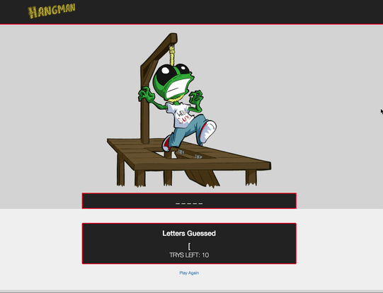

# Hangman - A web based Javascript hangman game.  

A Web based Javascript/ HTML5/ CSS application that randomly generates a word . 

## Live Demo

[See Hangman Live- Click Here!](https://ramirolpz55.github.io/week-3-game/)

## Usage

1. Clone repo
2. npm install
3. cd week-3-game
4. open index.html
5. Word should be listed with hashes. Hit any key to start choosing letters. 
6. ENJOY! 

## Contributing

1. Fork it!
2. Create your feature branch: `git checkout -b my-new-feature`
3. Commit your changes: `git commit -am 'Add some feature'`
4. Push to the branch: `git push origin my-new-feature`
5. Submit a pull request :D

## Tech Used 

* HTML5 
* CSS 
* JAVASCRIPT 
* CSS

## License

N/A
